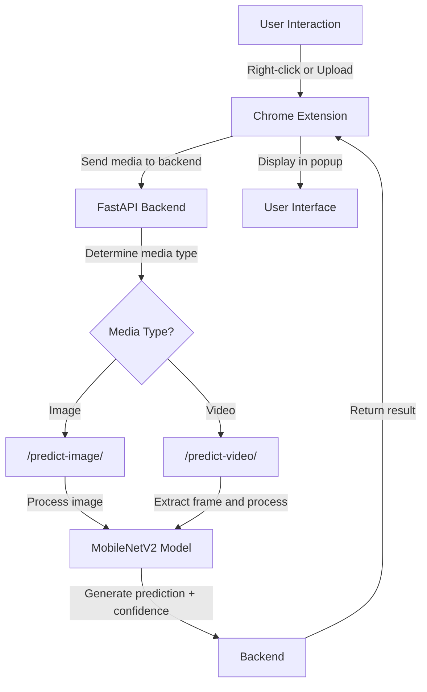
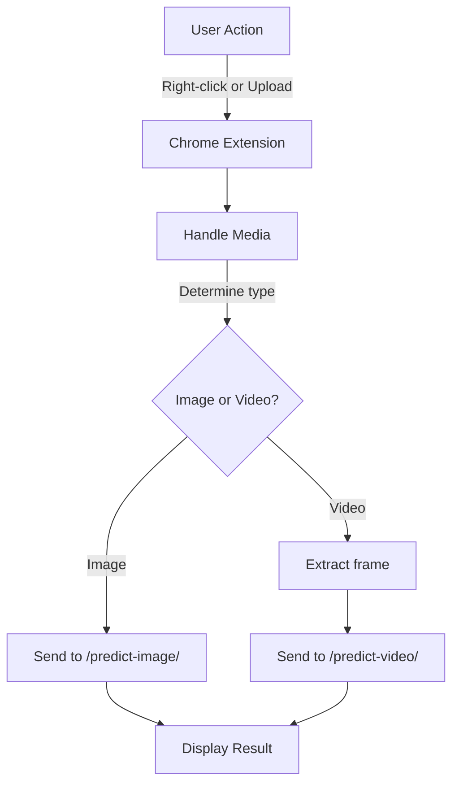
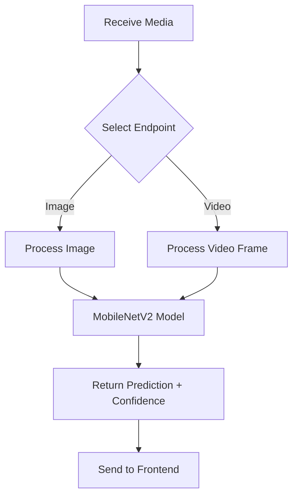

## 🎭 FaceGuard – Deepfake Image & Video Detector Extension

### 🔍 About the Project

**FaceGuard** is a browser extension powered by a deep learning model that detects whether an image or video contains a real human face or one generated by AI (deepfakes). It enables users to:

- 🖼️ Right-click on any image/video and instantly get authenticity results.
- 📁 Upload files via the popup interface.
- 📊 View confidence scores along with predictions.

This solution blends cutting-edge AI with a user-friendly UX to fight misinformation and manipulated content.

---

### 💡 Motivation

The rise of generative AI tools has blurred the line between real and synthetic media. Deepfakes pose serious threats to:

- 🔐 Personal identity
- 📰 Media credibility
- 🗳️ Election integrity
- 🧠 Public perception

**FaceGuard** serves as a **personal media watchdog**, helping users stay informed and alert.

---

## 🧠 The AI Model

The backend is powered by a fine-tuned **MobileNetV2** convolutional neural network trained on a curated deepfake detection dataset.

### ⚙️ Model Highlights

- ✅ Lightweight and optimized for fast inference
- ✅ Binary classification: `real` vs `fake`
- ✅ Supports both image and video (frame-based) analysis

### 🔁 Output

- **Prediction**: `real` or `fake`
- **Confidence Score**: Probability of authenticity (e.g., 92% real)

---

## 🧩 Extension Features

| Feature               | Description                                               |
|----------------------|-----------------------------------------------------------|
| 🖱️ Right-click Check  | Inspect any image/video on the web via context menu       |
| 📁 File Upload        | Upload media via the popup interface                      |
| 🔥 Real-time Results  | Get instant predictions and confidence scores             |
| 🔐 Secure API Calls   | Data sent securely to the backend for prediction          |

---

## 🚀 How It Works

### 🧩 Architecture

1. **Frontend**: Chrome Extension (Popup UI + Context Menu)  
2. **Backend**: FastAPI + MobileNetV2 Deepfake Detection Model  
3. **Communication**: REST API endpoints:  
   - `/predict-image/`  
   - `/predict-video/`

---

### 🌐 System Flow

---

### 🖥️ Frontend Workflow

---

### ⚙️ Backend Workflow

---

## 🛠️ Tech Stack

- 🧠 **Model**: MobileNetV2 (TensorFlow / Keras)
- ⚙️ **Backend**: FastAPI (Python)
- 🧩 **Frontend**: Chrome Extension (HTML, CSS, JavaScript)
- ☁️ **Deployment**: Render (Backend Hosting)

---

## 🔮 Future Scope

- 🧬 Train on more complex datasets (e.g., DFDC, CelebDF)
- 🎥 Integrate multi-frame analysis for better video detection
- 🌐 Support for Firefox & Edge browsers
- 🛒 Publish on Chrome Web Store

---

## 📄 License

MIT License. Feel free to fork, enhance, and build on **FaceGuard**. 🙌

---
